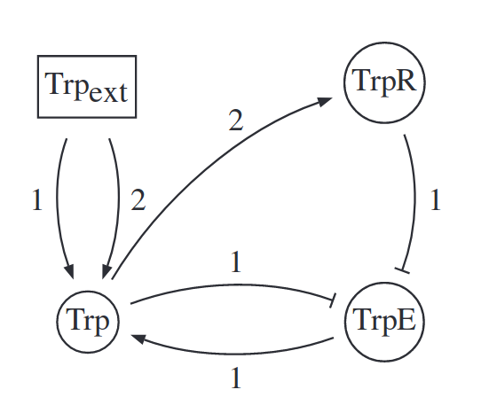

Its central motivation is the definition of a generic approach to obtain
an integrated modelling of the regulated Trp biosynthesis pathway.
In this context, we refer to Petri net models .
First, we present the modelling of the regulatory control of the Trp
biosynthesis in E.Coli (download Trp_reg.zginml). The following figure
illustrates the simplified logical regulatory graph. Each node of the
regulatory graph represents an active component: Trp, the active enzyme (i.e.
not associated with Trp), and the active repressor (the dimmeric form of TrpR
in association with Trp). The last node (Trpext) accounts for the import of
Trp from the external medium (note the permeation process is considered as
constitutive here, for sake of simplicity).

All nodes are binary ( i.e. can take the value 0 or 1), except Trp, which is
represented by a ternary variable (taking the values 0,1,2). The association
of tryptophan (at high levels) with the inactive form of the repressor
(aporepressor) gives rise to the active form of the repressor (holorepressor);
active repressor inhibits the transcription and thus the production of the
enzyme TrpE; this enzyme is needed to produce the aminoacid Trp; the
association of Trp (at moderate or high levels) with this enzyme inhibits its
activity.

The Petri nets for the biosynthetic pathway and the regulatory control are
available below (two PN formats), as well as the model integrating both levels
(see additional files and the supporting reference).

