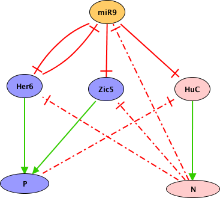

This Boolean model displays the subtle role of miR-9 in the course of neural
specification in zebrafish.

Figure 1: Green arrows represent positive regulations, whereas red T arrows
represent inhibitory interactions. Dotted lines represent suspected (but not
yet molecularly characterized) direct or indirect interactions, which prevent
the expression of a gene in the progenitor or neuronal precursor states, such
as elavl3/HuC inhibition in progenitors.

The node P denotes a proliferating progenitor state (P=1, N=0). It is defined
by the expression of Her6 and/or Zic5. The node N denotes the commitment of a
progenitor into a neural precursor (P=0, N=1).
By inhibiting genes with opposite effect on neural differentiation, miR-9
activity generates an ambivalent state (P=0, N=0) poised for responding to
both progenitor maintenance and commitment cues.

Model simulations qualitatively recapitulate all the experimental results
presented in Coolen et al (submitted), for the wild-type as well as for
various mutant situations (including loss-of-functions, ectopic gene
expressions, and miR-9 target protection by morpholinos).

