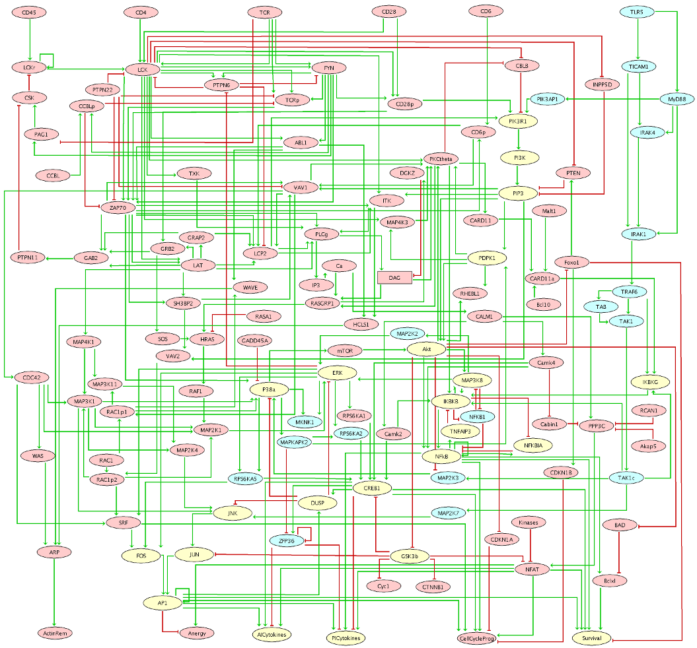

CD4+ T cells recognize antigens through their T cell receptors TCR). However,
additional signals involving co-stimulatory receptors, for example CD28, are
required for proper T cell activation. Alternative co-stimulatory receptors
have been proposed, including members of the Toll-like receptor family, such
as TLR5 and TLR2.

We report here three Boolean models for:

* the T cell receptor (TCR) signalling pathway;
* the Toll-like receptor (TLR5) signalling pathway;
* the combination of TCR and TLR5 pathway, taking into accounting cross-interactions.

These models were validated by analysing the responses of T cells to the
activation of these pathways alone or in combination, in terms of CREB, c-Jun
and p65 activation.
The resulting merged model accurately reproduces the experimental results,
showing that the activation of TLR5 can play a similar role to that of CD28,
regarding AP-1, CREB and NF-кB activation, thereby, providing insights
regarding the cross-regulation of these pathways in CD4+ T cells.

