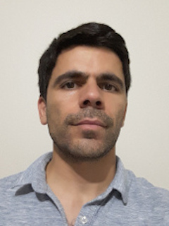
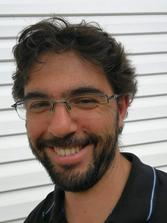

Please send your comments, questions or suggestions to the public
user group GINsim Users at [ginsim-users@googlegroups.com](mailto:ginsim-users@googlegroups.com).

As some problems might be difficult to reproduce, try to include a description of the problem and steps to reproduce it. If possible provide log traces (using the GINsim/support/export log traces menu entry) and to launch GINsim from the [command line](../install/index.md#running-ginsim) to catch additional error messages.

Specific questions can also be adressed to the GINsim team at [support@ginsim.org](mailto:support@ginsim.org).

## Meet the team

    

        

             
            <a href="http://claudine.chaouiya.perso.luminy.univ-amu.fr">Claudine Chaouiya</a> 
            Project coordination
        

        

             
            <a href="http://pedromonteiro.org">Pedro T. Monteiro</a> 
            Software development
        

        

             
            <a href="http://aurelien.naldi.info">Aur&eacute;lien Naldi</a> 
            Software development
        

        

             
            <a href="https://www.ibens.ens.fr/spip.php?rubrique27">Denis Thieffry</a> 
            Project coordination
        

    

### Former contributors

- Prototype development: Frederic Cordeil, Thomas Marcq, Cecile Menahem, Romain Muti
- Biological applications: Adrien Fauré, Aitor Gonzalez
- Software development: Duncan Berenguier, Fabrice Lopez, Kevin Mathieu, Rui Henriques, Nuno Mendes, Lionel Spinelli

The GINsim logo was designed by [Mauricio Guzman](http://www.altamirastudio.com.mx/).

---
GINsim is currently hosted at [GitHub Pages](https://pages.github.com/).
It was previously hosted at:

- TAGC, Université de la Méditerranée, FR, under `http://gin.univ-mrs.fr/GINsim`
- IGC, Oeiras, PT, under `http://ginsim.org`
- INESC-ID, Lisbon, PT, under `http://ginsim.org`

