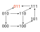
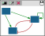
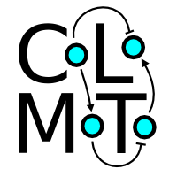

# Welcome to GINsim

{: style="width: 120px; float: left; margin-right: 10px;"}

_GINsim_ (**G**ene **I**nteraction **N**etwork **sim**ulation) is a graphical application to ease the design and the dynamical analysis of Boolean and multilevel logical models of cellular regulatory networks.

GINsim relies on a graph-based representation of regulatory networks, called _logical regulatory graph_, as well as on a graph-based representation of the dynamics, called _state transition graph_.

## Model definition, alteration and analysis

The _GINsim_ graphical interface facilitates the definition of a _logical regulatory graph_ (LRG) with the insertion and deletion of nodes, as well as of various kinds of directed arcs (activations, inhibitions, dual or unknown arcs). The user can further associate textual and hyperlink annotations to keep track of supporting data.

The logical rules defining the responses of a target node to the levels of their regulators can be encoded as classical Boolean expressions (using the AND, OR and NOT operators), or in terms of combinations of interactions enabling the activation of the target node to a specified level (equivalent to Snoussi & Thomas' logical parameters). Internally, these logical rules are encoded as multilevel decision diagrams, which are used for the computation of various dynamical properties.

A _GINsim_ model can be associated with a series of perturbations (e.g. loss-of-function or ectopic activity of a node, or any combination thereof), as well as with a set of reference states (e.g. initial states), which can all be defined through graphical panels.

GINsim further includes:

- the verification of the consistency between the model graphical representation (arc occurrences and signs) with the logical rules associated with its nodes;
- the efficient computation of the stable states of a model;
- the identification of all regulatory circuits, evaluation of  their signs based on the logical rules associated with their nodes, and assessment of their functionality sub-spaces;
- the colouring of the regulatory graph on stable states (displaying active nodes and interactions) or on user defined states;
- a multiple graph functionalities, also applicable to state transition graphs, and listed below;
- the possibility to reduce a model, by removing specific components;
- the conversion of a multivalued model into a Boolean one;
- the reversion of a model resulting in a model that produces a reverse (asynchronous) dynamics;
- the functionalities to import models encoded in a variety of formats, primarily [_sbml-qual_](https://colomoto.github.io/formats/sbml-qual/),
ensuring interoperability with other logical modelling tools (truth tables, [BoolNet](https://cran.r-project.org/web/packages/BoolNet/index.html), 
[BoolSim](https://www.sib.swiss/vital-it/research-software),
[Bnet](https://www.cs.rice.edu/~lm30/RSynth/CUDD/nanotrav/doc/bnetExtDet.html) and [cnet (BNS tool)](https://people.kth.se/~dubrova/bns.html) formats);
- the functionalities to export models in different formats used by complementary tools
(e.g. the model checker [NuSMV](https://nusmv.fbk.eu/) or the stochastic simulation tool [MaBoSS](https://maboss.curie.fr/)),
including [_sbml-qual_](https://colomoto.github.io/formats/sbml-qual/).

## Model simulation

{: style="float: right; margin-right: 5px;"}

GINsim includes a comprehensive panel of functionalities to simulate logical models:

- several simulation tools using different state updating policies (synchronous, asynchronous, sequential, ...);
- simulation settings for model perturbations (constraining components values as well as interactions functionalities);
- construction of the dynamics in terms of State Transition Graph (STG) or compacted form of the STG (Strongly Connected Components (SCC) graph  and Hierarchical Transition Graph (HTG));
- estimation of attractors reachability;
- an algorithm to compute the trap spaces of a model, which encompass stable states and subspace approximations of cyclic attractors.

## Functionalities for the different graphs

{: style="float: right; margin-right: 5px;"}

GINsim offers various operations on graphs (LRG, STG, SCC or HTG):

- export in graphical formats (PNG, SVG);
- various graph layout and graph exploration algorithms;
- construction of the SCC graph for LRG and STG;
- saving in different formats.

## Interoperability and CoLoMoTo

{: style="float: right; margin-right: 5px;"}

GINsim can load and export models from the [SBML qual](https://sbml.org/documents/specifications/level-3/version-1/qual/) format,
easing their sharing with other software tools.
Its integration in the [CoLoMoTo notebook](https://colomoto.github.io/colomoto-docker/) enables the definition of complex, reproducible analysis workflows,
for example:

- Efficient reachability analysis using [pint](http://loicpauleve.name/pint);
- Complex reachability analysis using the [NuSMV model checker](https://nusmv.fbk.eu);
- Quantification of reachability probabilities using [MaBoSS](https://maboss.curie.fr);
- 2D modelling of a cellular tissue using [Epilog](http://epilog-tool.org).

