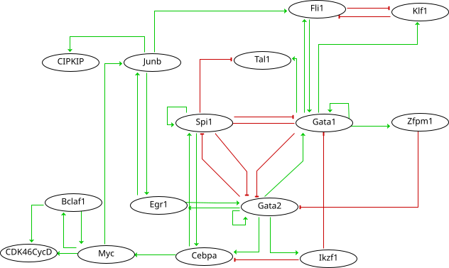

Hematopoietic stem cell (HSC) aging is a multifactorial event leading to changes in HSC properties and functions, which are intrinsically coordinated and affect the early hematopoiesis. To better understand the mechanisms and factors controlling these changes, we developed an original strategy to construct a Boolean model of HSC differentiation. Based on our previous scRNA-seq data, we exhaustively characterized active transcription modules or regulons along the differentiation trajectory and constructed an influence graph between 15 selected components involved in the dynamics of the process. Then we defined dynamical constraints between observed cellular states along the trajectory and using answer set programming with in silico perturbation analysis, we obtained a Boolean model explaining the early priming of HSCs. Finally, perturbations of the model based on age-related changes revealed important deregulations, such as the overactivation of Egr1 and Junb or the loss of Cebpa activation by Gata2. These new regulatory mechanisms were found to be relevant for the myeloid bias of aged HSC and explain the decreased transcriptional priming of HSCs to all mature cell types except megakaryocytes.

